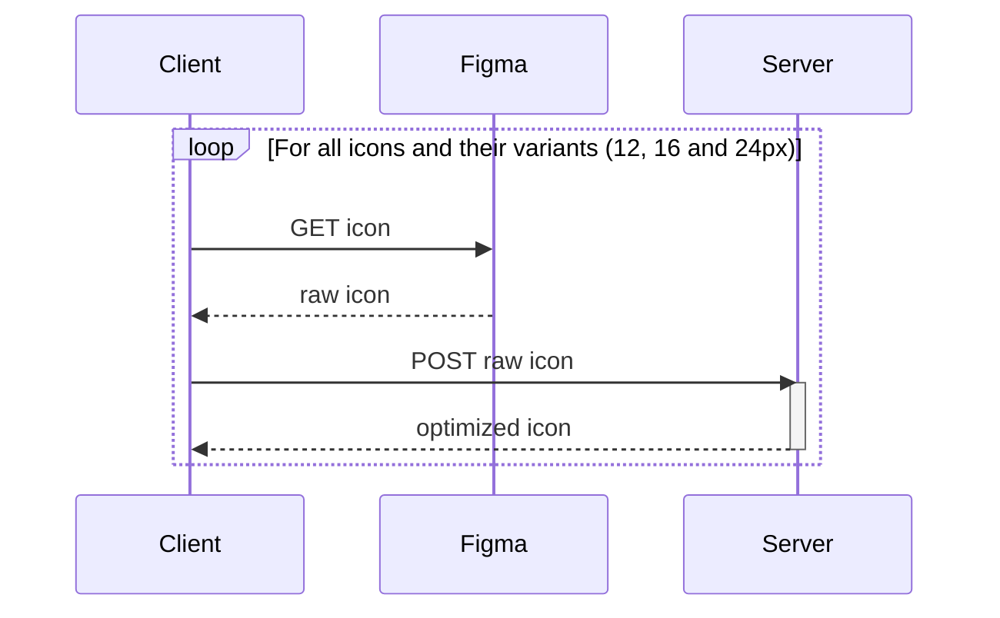
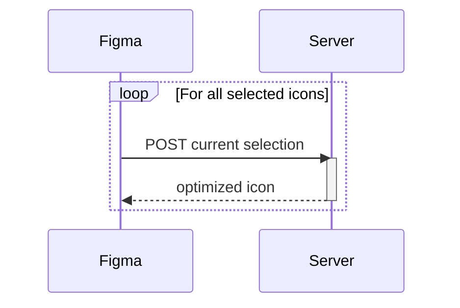

# UX tools

UX tools are dedicated tools for helping teams to accelerate UX workflows.

### Process SVG 

Function as a Service which takes a raw SVG file in input and will return an optimized SVG as output.
It's only reachable on the Talend network, for some performance reasons, at https://svg-optimizer.tools.dev.datapwn.com.

### Figma

Talend's icons are built over Figma. 
And Figma is the single source of truth where raw icons must continue to live.
That's why we want to automate the process of optimization even in our Figma files and in the codebase.

To do so, we have two ways: 

* the downloader binary, which can be part of a GitHub Action triggered by webhook.  
* the Figma plugin, which can be used in-app (example Figma), on a single icon, and "pathfinds" anything that's not colored with the `neutral/icon` design token.

#### Downloader

This script helps you to get all Icons stored in a Figma file and, in the meantime, to optimize them one-by-one on the fly.
Those icons will be stored next to from where the script will be run.

#### Plugin

This plugin helps you to generate the simplest optimized copy of an icon, using the SVG Process service, next to the original.

