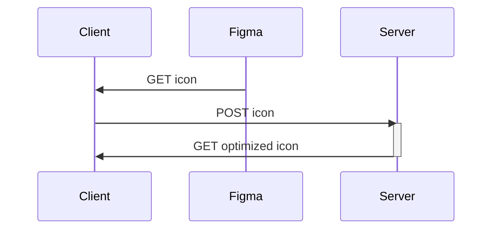
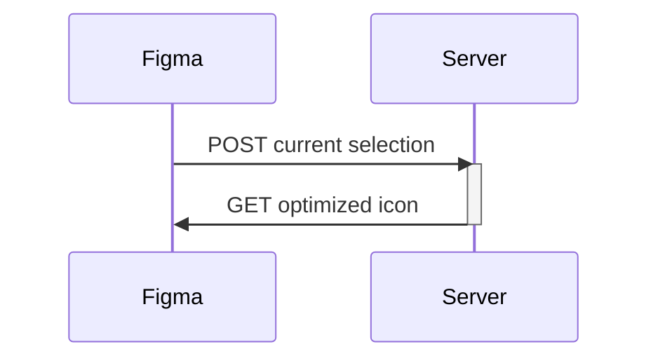

# UX tools

## Process SVG 

```bash
$> docker build -t process-svg ./process-svg 
$> docker run -it -p 1234:1234 process-svg
```

## Figma

Talend's icons are built over Figma.

### Downloader

This script helps you to get all Icons stored in the Figma file and to optimize them one-by-one in the meantime.



### Plugin

This plugin help you to generate the simplest copy of an icon, using an API hosted at Talend.


